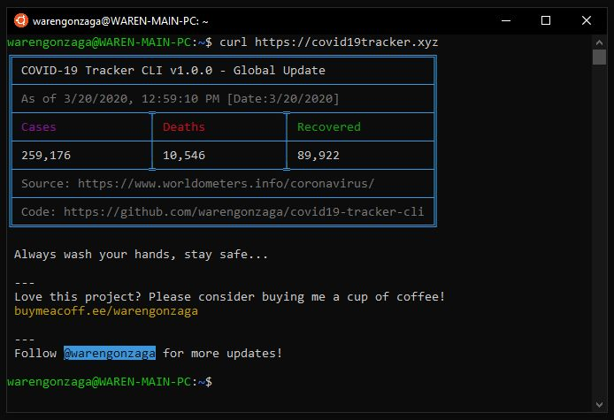

# COVID-19 Tracker CLI [](https://facebook.com/warengonzagaofficial)

[](https://github.com/warengonzaga/covid19-tracker-cli/releases)
[](https://github.com/warengonzaga/covid19-tracker-cli)
[](https://github.com/warengonzaga/covid19-tracker-cli)
[](https://github.com/warengonzaga/covid19-tracker-cli)
[](https://nodejs.org)


**COVID-19 Tracker CLI** is an open-source NodeJS application for command line interface to track COVID-19 cases around the world. An optimized NodeJS application and a simple tracker with real-time updates from reliable data source. [Visit Wiki](https://github.com/warengonzaga/covid19-tracker-cli/wiki)

## Featured By

Wanna feature this project? Let me know!

## How it Works

It uses an API and collect the relevant information for your reference.

> Data Source: <https://www.worldometers.info/coronavirus/>

## Features

This simple application offers you the following features...

* Real-Time udpates.
* Optimized application.
* Fast response time (~< 100ms).
* Simple layout and easy to understand.
* By country query.
  * e.g. (```/country```).
* By country with History Chart
  * e.g. (```/history/<country>/``` or append with ```<cases or deaths>```)
* Windows CMD support.
  * e.g. (```/cmd``` or ```/cmd/country```).
* Plain or Basic version.
  * e.g. (```/plain``` or ```/plain/country```) or (```/basic```, ```/basic/country```).
* Random health saying on footer.

_More features coming soon..._

## Basic Usage

### Global Tracking

To track COVID-19 cases on CLI globally, all you need to do is to use CURL or WGET command.

#### CURL

```bash
curl https://covid19tracker.xyz
```

#### WGET

```bash
wget -i https://covid19tracker.xyz && cat index.html
```

#### HTTPie

```bash
# visit httpie.org
http http://covid19tracker.xyz
```

### Country Tracking

To track COVID-19 cases on CLI by country, all you need to do is to append the URL with the country name or country [ISO 3166-1](https://warengonza.ga/iso-3166-1-codes) code.

#### Country Name

```bash
# example usage
curl https://covid19tracker.xyz/philippines
```

#### Country ISO 3166-1 Code

```bash
# /ph or /phl is ISO 3166 code of the Philippines
curl https://covid19tracker.xyz/ph
```

#### Country with History Chart

```bash
# shows result with history chart
curl https://covid19tracker.xyz/history/ph
```

```bash
# shows by default a history chart
curl https://covid19tracker.xyz/history/ph/cases
```

```bash
# shows result with history chart
curl https://covid19tracker.xyz/history/ph/deaths
```

## Advance Usage

### Check Update Automagically

```bash
# check update every 10 seconds (where -n 10 is the interval)
watch -n 10 curl https://covid19tracker.xyz
```

### Create a Shortcut Command

```bash
# set a desired alias for the command (replace endcov with your desired alias)
# this will give you a global update
# alias <your alias>="curl https://covid19tracker.xyz"

alias endcov="curl https://covid19tracker.xyz"

# if you want to track a specific country
# alias <your alias>< coutry alias>="curl https://covid19tracker.xyz/<country name, ISO2, ISO3 here>"

alias endcovPH="curl https://covid19tracker.xyz/philippines"
```

## Official Blog

Many people asking me how to properly use my tracker. Here's the blog on [How to Track Coronavirus on Command Line](https://warengonza.ga/covid19-tracker-cli). If you have comments or suggestions please leave it on the comment section of the blog.

## Screenshots

Here's the screeshot of the tracker on CLI...



## White Label / Personalize / Custom / Development

Working on it...

## Regional Trackers

* [Philippines](https://ncovtracker.doh.gov.ph)
* [Italy](https://opendatadpc.maps.arcgis.com/apps/opsdashboard/index.html#/b0c68bce2cce478eaac82fe38d4138b1)
* [India](https://www.covid19india.org)
* [USA](https://www.npr.org/sections/health-shots/2020/03/16/816707182/map-tracking-the-spread-of-the-coronavirus-in-the-u-s)
* [France](https://veille-coronavirus.fr)
* [Japan](https://covid19japan.com)

## Contributing

Contributions are welcome, create a pull request to this repo and I will review your code. Please consider to submit your pull request to the ```dev``` branch. Thank you!

## Issues

If you're facing a problem in using COVID-19 Tracker CLI please let me know by creating an issue in this github repository. I'm happy to help you! Don't forget to provide some screenshot or error logs of it!

## To Do

* Local Version
* Add Static Version
* Sample Usage (gif)
* Add HTTP Headers (currently F)
* More Code Refactor! (I guess I know what I'm doing now... for sure)
* More... (have suggestions? let me know!)

## Community

Wanna see other projects I made? Join today!

[](https://bmc.xyz/l/wgofficialds)

## Donate or Support

If you love this project please consider to support the development by means of coffee. I spend and waste my time just to save your time! Be a sponsor or backer of this project. Just a cup of coffee!

[](https://paypal.me/warengonzagaofficial)
[](https://www.buymeacoffee.com/warengonzaga)

## Supporters and Backers

* J. Archer, Gonzalo Montes

Wanna see your name here? [Just buy me a coffee](https://www.buymeacoffee.com/warengonzaga)!

## License

COVID-19 Tracker CLI is licensed under MIT - <https://opensource.org/licenses/MIT>

## Code of Conduct

[Read the Code of Conduct](./code-of-conduct.md)

## Sources

* API from [NovelCOVID API](https://github.com/NovelCOVID/API) which based on [WorldMeter](https://www.worldometers.info/coronavirus)

* Data from [CSSE at Johns Hopkins University](https://github.com/CSSEGISandData)

## Related Projects

* <https://github.com/sagarkarira/coronavirus-tracker-cli>

## Other Projects

* [WiFi Passview](https://github.com/warengonzaga/wifi-passview) is an open-source batch script-based program that can recover your WiFi Password easily in seconds.

* [WRN Cleaner](https://github.com/warengonzaga/wrn-cleaner) is an all in one batch script based native PC maintenance and cleaner for Windows.

## Resources

* <https://github.com/soroushchehresa/awesome-coronavirus>
* <https://github.com/fight-covid19/community>

## Author

COVID-19 Tracker CLI is Developed and Maintained by **Waren Gonzaga** and **Ian Vizarra**

* **Facebook:** <https://facebook.com/warengonzagaofficial>
* **Twitter:** <https://twitter.com/warengonzaga>
* **Website:** <https://warengonzaga.com>
* **Email:** dev(at)warengonzaga[.]com

---

**</>** with **<3** by **Waren Gonzaga**
